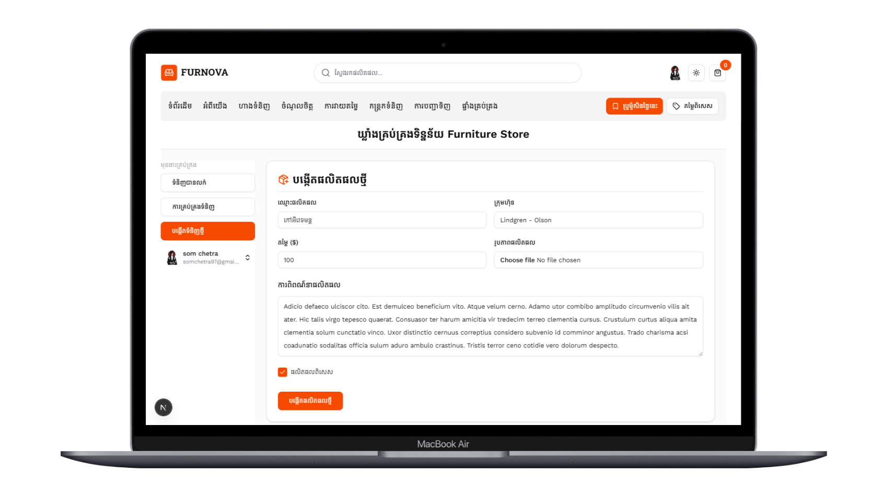
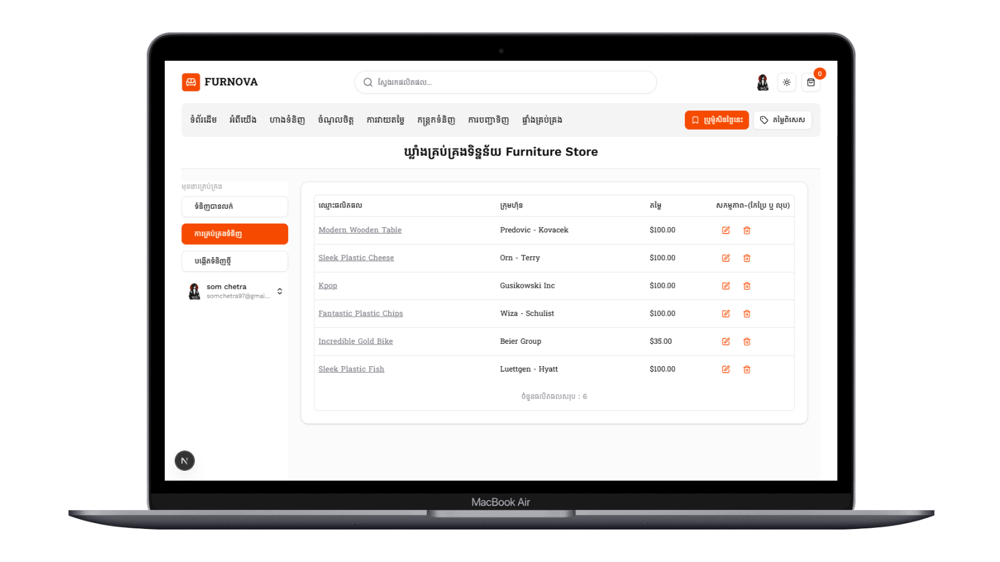
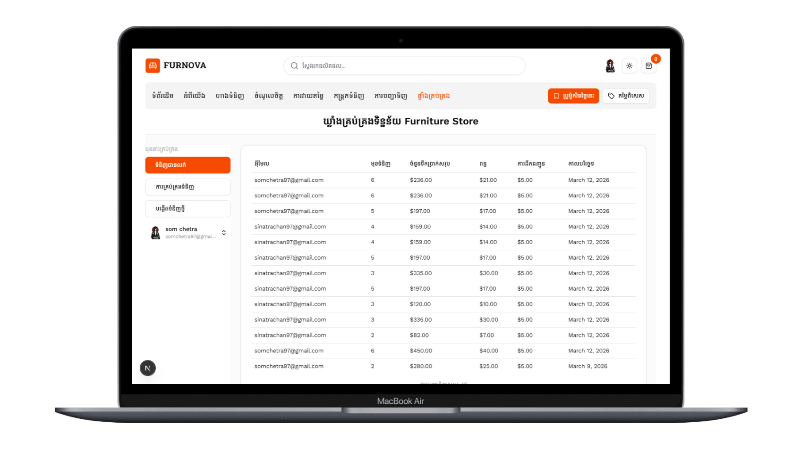
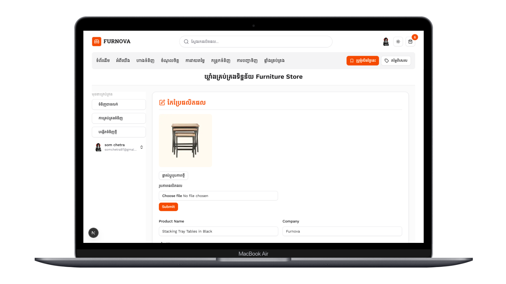
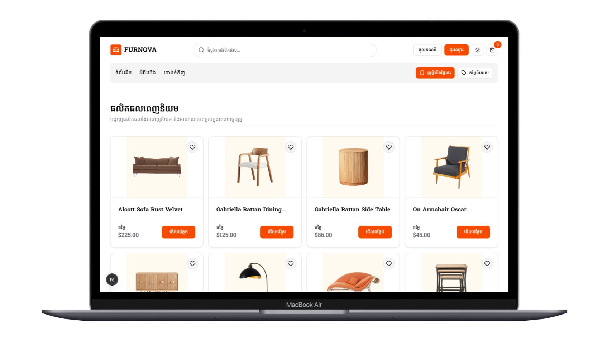
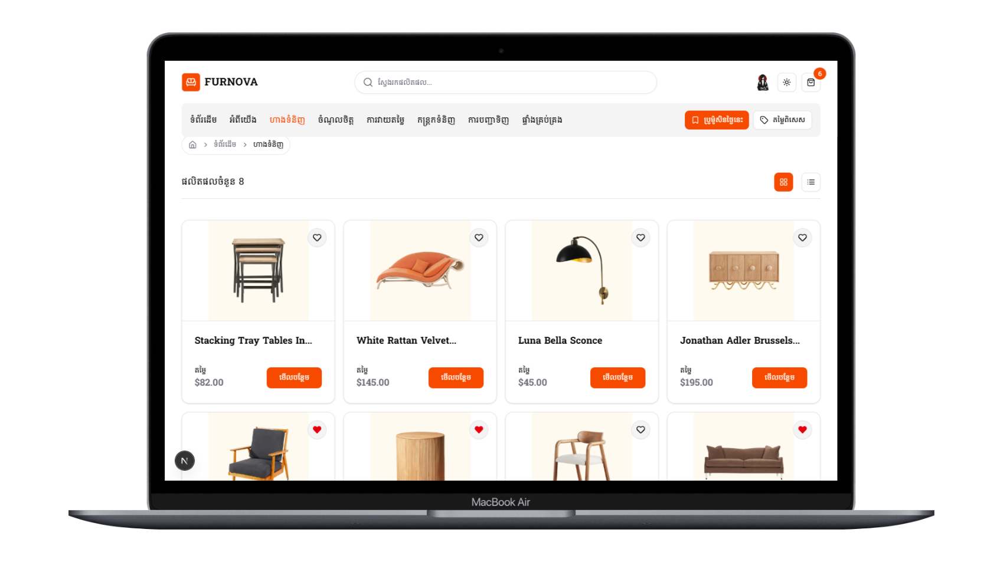
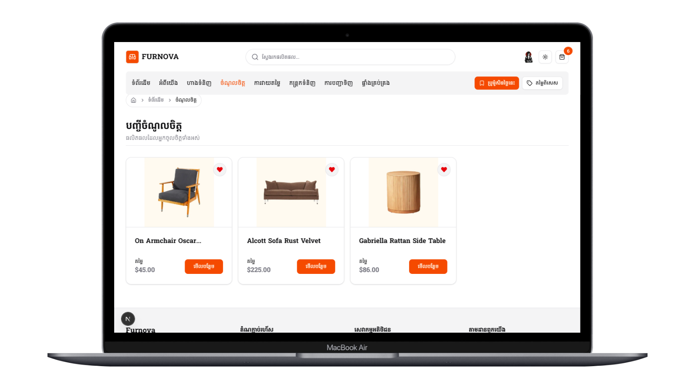
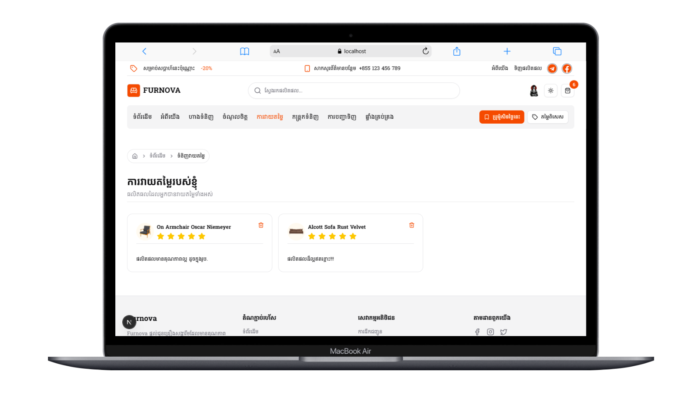
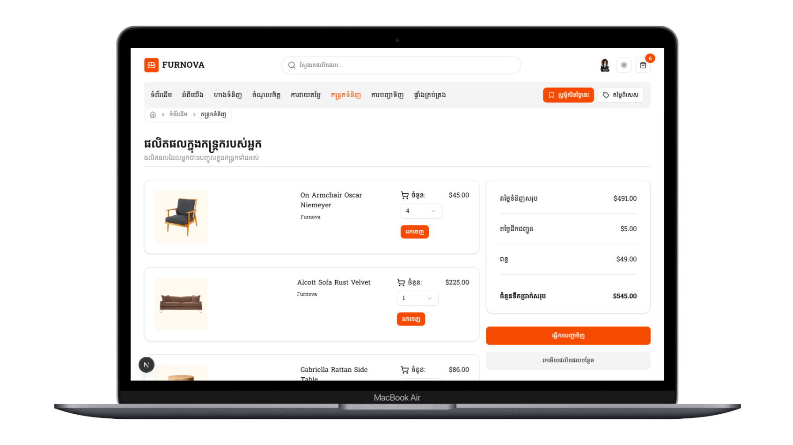
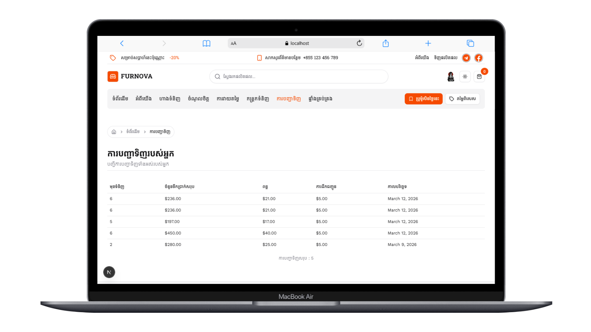

# 🪑 Furnova Furniture Store
> Next.js • Prisma • Supabase(PostgreSQL) • Stripe • TailwindCSS • shadcn/ui

**Furnova Furniture Store** is a full-stack eCommerce web application designed to provide a modern and convenient way for customers to browse and purchase furniture online. The platform allows users to explore a wide range of furniture products, view detailed product information, save favorite items, write reviews, and securely complete purchases through an integrated Stripe payment system.

The goal of this project is to simulate a real-world online furniture store where customers can easily discover products and manage their shopping experience in a simple and user-friendly interface. By providing features such as favorites, reviews, and order history, the platform enhances customer engagement and helps users make better purchasing decisions.

In addition to the customer-facing features, Furnova also includes a powerful **admin dashboard** that enables administrators to efficiently manage the store's product catalog. Admin users can create new products, update product information, upload product images, and remove products when necessary. The dashboard also provides an overview of store activity, helping administrators monitor sales and maintain the store's inventory.

This project demonstrates the development of a complete **full-stack eCommerce system**, combining modern frontend technologies with a robust backend architecture. It highlights best practices in building scalable web applications, including responsive design, secure authentication, image optimization, and efficient database management.

Furnova was built as a practical project to showcase real-world development skills in creating a modern online store, focusing on performance, usability, and maintainability.

---

## 🚀 Features
#### 1. Customer Features
- Home page with featured furniture products
- Search and browse furniture products
- View detailed product information
- Save favorite products
- Write and read product reviews
- Add and manage items in shopping cart
- Secure checkout with Stripe
- View order history
- User authentication (Register / Login / Logout)

#### 2. Product Management (Admin)
- Create new products
- View all products
- Edit product information
- Delete products
- Upload and manage product images

#### 3. Admin Dashboard
- Sales dashboard overview
- Manage store products
- Monitor customer orders

#### 4. General Features
- Responsive design for mobile and desktop
- SEO optimization
- Optimized images using WebP
- Modern UI built with TailwindCSS and ShadCN

---

## 🛠️ Tech Stack
**Frontend**
- Next.js 16 (App Router)  
- TypeScript  
- TailwindCSS
- shadcn/ui  

**Backend / Database**
- Prisma ORM  
- Supabase (PostgreSQL) 

**Authentication**
- Clerk

**Payments**
- Stripe (sandbox) 

---

### ⚡ SEO Features
- Dynamic Metadata with Next.js generateMetadata for SEO.
- Optimized URL structure for better search visibility.
- Descriptive titles and meta descriptions.
- Open Graph (OG) tags for improved social sharing.
- Lazy loading for images to boost performance.
---

### 📂 Project Structure
```html
/app          # Next.js App Router pages and layouts
/components   # Reusable UI components (cards, buttons, forms, etc.)
/data         # Static data or JSON files for seeding/testing
/hooks        # Custom React hooks
/lib          # Helper functions and utilities
/prisma       # Database schema, migrations, and Prisma client
/public       # Static assets (images, icons, fonts)
/styles       # Global styles, Tailwind configuration, and CSS files
/types        # TypeScript types and interfaces
/utils        # Utility functions for various features
```
___

### 🌐 Live Demo
[Visit Furnova Furniture Store](https://nextjs-furniture-ecommerce-store-20.vercel.app)

## 📸 Screenshots

### 📊 Admin Dashboard




___

### 📸 Homepage


___
### 📸 Products Page


___
### 📸 Favorites Page


___
### 📸 Reviews Page

___
### 🛒 Cart Page


___
### 📸 Order Page
